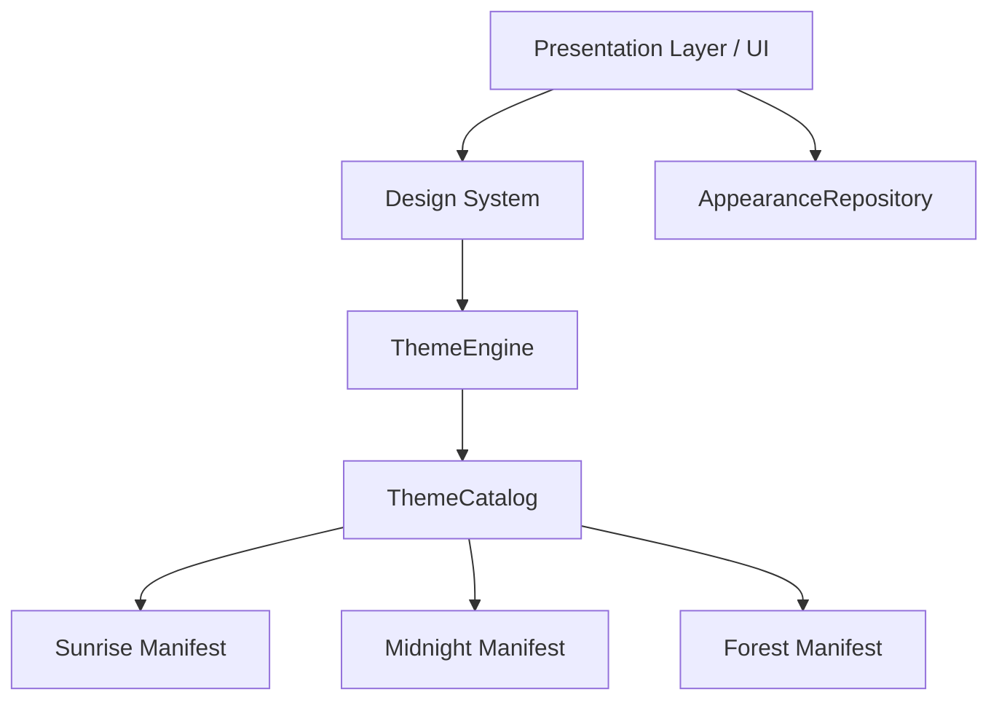

# 🏛️ ADR-014: Activity History Recommendations & Decoupled Experience Themes Subsystem (Revised Final)

**Estado:** Aprobado (Especificación Final Completa)

---

## Contexto

Con la finalización de **VS-024**, la aplicación ha evolucionado para contar la historia de cada compromiso a través de eventos persistidos en forma de `ActivityRecord`. Para garantizar el desacoplamiento entre el backend y el frontend, y facilitar la mantenibilidad a largo plazo (especialmente de cara a futuras migraciones a PostgreSQL/Supabase y la evolución de los requisitos de producto), se requieren contratos estables.

Adicionalmente, se introduce el soporte para **Experience Themes** (Amanecer, Medianoche, Bosque) como una capacidad transversal que altera no solo la paleta de colores, sino también componentes visuales, tipografías secundarias, ilustraciones, gráficos, estados de carga/error/vacío (Empty States) y animaciones. Este subsistema debe diseñarse para evitar la deuda técnica y permitir la adición futura de nuevos temas (Océano, Sakura, Cyberpunk, etc.) de forma totalmente modular, estableciendo una arquitectura limpia y desacoplada a nivel de monorepo.

---

## Decisiones y Recomendaciones

### 1. Historial de Actividades (Activity History)

Para asegurar un contrato estable y evitar que cambios en el backend rompan la UI móvil:

#### A. `ActivityType` como Contrato Estable

Se prohíbe el uso de strings libres en las llamadas y payloads de actividades. En su lugar, se define un enum compartido que sirve de contrato entre Backend y Mobile:

```ts
enum ActivityType {
  Registered,
  Activated,
  Paused,
  Resumed,
  Completed,
  Cancelled,
  Edited,
}
```

#### B. Metadata Versionada en `ActivityRecord`

Para permitir la evolución de los campos de metadata de las actividades antiguas sin romper la compatibilidad, el modelo `ActivityRecord` se extiende para incluir un campo de versión:

```ts
export class ActivityRecord {
  readonly id: string;
  readonly version: number; // Versión de la metadata (e.g., 1, 2)
  readonly type: ActivityType;
  readonly occurredAt: Date;
  readonly actor: string;
  readonly metadata: Record<string, any>;
}
```

#### C. Timeline Preparado para Paginación

El endpoint de consulta de historial se diseñará utilizando parámetros de paginación basados en cursor (`cursor` y `limit`), aun cuando el repositorio interno utilice almacenamiento en memoria. Esto evita tener que rediseñar el contrato de la API en el futuro al migrar a base de datos persistente:

```text
GET /v1/commitments/:id/history?cursor={cursor}&limit={limit}
```

---

### 2. Arquitectura de Experience Themes

Para evitar la deuda técnica y soportar futuras ampliaciones multiplataforma (Web, Escritorio, Widgets), el subsistema de temas adopta una estructura puramente desacoplada:



#### A. ThemeEngine Agnóstico de Tamagui (`@commitment/theme-engine`)

El motor de temas se extrae a un paquete independiente del monorepo (`packages/theme-engine/`) que es **totalmente agnóstico de Tamagui** u otros frameworks de salida:

- `@commitment/theme-engine`: Provee la resolución de tokens y control del tema activo. Produce únicamente una estructura de datos pura del tipo `ResolvedTheme` (conteniendo `colors`, `spacing`, `radius`, `typography`, `motion`, `illustrations`).
- `@commitment/design-system` (o componentes móviles/web): Importa `@commitment/theme-engine` y realiza el puente (bridge) final hacia Tamagui o el motor visual correspondiente. Esto habilita reutilizar el motor de temas en React Web, Apple Watch o Widgets sin reescribirlo.

#### B. Modelo de Dominio Sincronizable de Apariencia (`Appearance`)

La apariencia visual del usuario se modela como un Bounded Context o entidad de Dominio:

- **`Appearance` (Entidad de Dominio)**: Contiene atributos cohesivos:
  - `Theme` (Sunrise, Midnight, Forest, etc.)
  - `Language` (i18n)
  - `Accessibility` (Ajustes específicos de accesibilidad)
  - `Motion` (Parámetros de animación/reduce-motion)
  - `Typography` (Ajustes de Dynamic Type / Tamaño de fuente)
  - `Preferences` (System Theme, High Contrast)
- **`AppearanceRepository` (Puerto de Dominio)**: Contrato abstracto para cargar, guardar y observar los cambios del dominio de apariencia:
  - `load(): Promise<Appearance>`
  - `save(appearance: Appearance): Promise<void>`
  - `observe(): Stream<Appearance>`
- **Estrategia de Sincronización**: El contrato y el puerto de repositorio se diseñan considerando la sincronización cloud: `Appearance` -> local cache -> backend profile -> otros dispositivos, aunque inicialmente la implementación del adaptador persista en Secure Storage local.

#### C. Estructura y Versionado de `ThemeManifest`

Cada tema debe implementar una interfaz versionada que defina tokens de diseño semánticos en lugar de paletas de colores planos:

```ts
interface ThemeManifest {
  readonly id: string;
  readonly version: number; // Incrementable ante rediseños del tema (e.g. version: 1)
  readonly displayNameKey: string; // Clave de localización i18n
  readonly descriptionKey: string; // Clave de localización i18n
  readonly semanticColors: SemanticColors; // Mapeo de tokens semánticos (surface, surfaceSecondary, surfaceElevated, card, cardPressed, success, warning, danger, focus, border, divider)
  readonly typography?: ThemeTypography; // Tipografías secundarias/estilos
  readonly illustrations: ThemeIllustrations; // Ilustraciones específicas por tema
  readonly emptyStates: ThemeEmptyStates; // Empty states visuales y copias motivacionales
  readonly charts: ThemeCharts; // Estilos y paletas para gráficos
  readonly motion: ThemeMotion; // Curvas y tiempos de transición (150–250 ms)
  readonly icons: ThemeIcons; // Variaciones de iconos
  readonly gradients: ThemeGradients; // Gradientes de fondo/cabeceras
  readonly accessibility: ThemeAccessibility; // Ajustes de contraste/lectura
}
```

#### D. Componente Reutilizable `ThemePreviewCard`

Para evitar la duplicación de código, la tarjeta que muestra la vista previa interactiva del tema se centraliza en un único componente reutilizable `ThemePreviewCard`. Este se utilizará en las pantallas de **Profile**, **Onboarding**, **Configuración** y campañas promocionales futuras.

---

### 3. Tokens de Diseño Avanzados

Para garantizar que el sistema visual sea completamente dinámico y reactivo a los Experience Themes, se establecen las siguientes reglas de asignación de tokens:

#### A. Tokens Semánticos por Rol

Los colores de la interfaz de usuario se mapean estrictamente en función de su **rol en la interfaz** y no del componente que los dibuja:

- `background` / `backgroundSecondary`: Fondos base de la aplicación.
- `surface` / `surfaceRaised`: Contenedores de elementos y elevaciones (ej. tarjetas, menús).
- `contentPrimary` / `contentSecondary` / `contentTertiary`: Colores de texto y contenido principal.
- `accent`: Color destacado o llamada a la acción principal.
- `success` / `warning` / `danger` / `info`: Colores de estado del sistema.
- `interactive`: Elementos con estados clicables (hover, active, pressed).
- `focus`: Bordes e indicadores de enfoque/accesibilidad.
- `divider`: Líneas divisorias y bordes neutros.

#### B. Motion Tokens

Las duraciones y curvas de animación se definen mediante tokens dinámicos en lugar de valores fijos en los componentes:

- `fast` / `normal` / `slow`
- `spring`
- `pageTransition` / `modalTransition`
- `buttonPress`
- `cardEntrance`
- `listAnimation`

Cada uno de los tres Experience Themes modificará el comportamiento de estos tokens (ej. **Midnight** tendrá transiciones más lentas, fluidas y elegantes; **Sunrise** usará animaciones más rápidas, elásticas y enérgicas).

#### C. Icon Tokens

Los iconos se resuelven dinámicamente de acuerdo con el tema activo a través de tokens, permitiendo redefinir el estilo visual completo (ej. iconos rellenos vs lineares):

- `theme.icons.success`
- `theme.icons.warning`
- `theme.icons.commitment`
- `theme.icons.profile`

#### D. Illustration Tokens

Las ilustraciones de la aplicación (ej. estados vacíos) se asocian a tokens para adaptarse visualmente a la identidad cromática y emocional del tema:

- `theme.illustrations.emptyCommitments`

---

### 4. Arquitectura de Plugins para Widgets

Los componentes informativos del dashboard principal se desarrollan como plugins aislados gestionados por un registro centralizado (`WidgetRegistry`):

- `Dashboard` ──► `WidgetRegistry` ──► `[TodayWidget, WeeklyProgressWidget, QuickActionsWidget, StreakWidget, CalendarWidget]`.
- Esta arquitectura de plugins facilita aislar la lógica de presentación de cada Widget, reduce el acoplamiento y prepara el sistema para que en fases futuras el usuario pueda personalizar, activar, desactivar o reordenar sus propios widgets.

---

### 5. Paquete de Localización Compartido (`@commitment/localization`)

Se introduce un nuevo paquete compartido en el monorepo (`packages/localization/`) que proporciona un SDK centralizado de internacionalización y formateo:

- Evita la importación directa y duplicada de librerías de i18n o Intl en aplicaciones y componentes.
- Proporciona las funciones del SDK:
  - `t(key: string, variables?: Record<string, any>): string`
  - `formatDate(date: Date, format: string): string`
  - `formatNumber(value: number): string`
  - `formatRelativeDate(date: Date): string`
  - `changeLanguage(lang: string): Promise<void>`
  - `currentLocale(): string`
- **Regla de Internacionalización para Componentes del Design System**:
  > **Ningún componente del Design System puede recibir un string traducido como prop si puede aceptar en su lugar una clave de localización (`i18nKey`).**
  - **Correcto:** `<Button i18nKey="common.save" />`
  - **Incorrecto:** `<Button title={t('save')} />`

---

### 6. Estrategia de Entrega (Roadmap de Transición)

Para reducir el riesgo de integración y asegurar entregas incrementales de alto valor:

#### VS-025: Dashboard Experience Foundation

Se enfoca en transformar la interfaz funcional del dashboard en una experiencia comercial y premium utilizando el tema estático (**Sunrise**):

- Layout definitivo, cabecera premium y greeting dinámico.
- Tarjetas KPI, skeletons premium, empty states ilustrados y estados de carga.
- Layout responsive, adaptabilidad base y accesibilidad (VoiceOver base).

#### VS-026: Theme Engine Foundation

Construcción del motor de temas agnóstico de salida (`packages/theme-engine/`) y sus tokens de diseño asociados:

- Interfaces y tipos para `ResolvedTheme`, `ThemeManifest`, y `ThemeCatalog`.
- Adaptador base y puerto de `AppearanceRepository`.
- Definición de tokens semánticos por rol en la UI, tokens de movimiento (Motion), Icon tokens e Illustration tokens.
- Sin selector de temas integrado en la UI todavía.

#### VS-027: Experience Themes

Activación de la capacidad dinámica del motor e identidades visuales:

- Manifiestos estáticos para **Sunrise**, **Midnight** y **Forest**.
- Selector de temas en Perfil con `ThemePreviewCard` interactivo.
- Persistencia de apariencias en almacenamiento seguro y sincronización.
- Transición animada de temas hardware-accelerated (150–250 ms).

#### VS-028: Widget Registry

El Dashboard pasa a ser extensible mediante el registro de plugins de widgets en el `WidgetRegistry`.

#### VS-029: Motion System

Animaciones de entrada compartidas, transiciones de widgets y microinteracciones de interfaz.

#### VS-030: Accessibility & Polish

Soporte avanzado de lectores de pantalla, fuentes dinámicas avanzadas y optimización final de UX.

---

## Consecuencias

- **Positivas:**
  - Independencia total de Tamagui en el motor de temas, permitiendo su reutilización directa en Web, Widgets y Wearables.
  - Sincronización transparente de configuraciones de apariencia entre múltiples dispositivos.
  - Centralización del formateo y traducción en un SDK de localización unificado (`@commitment/localization`).
  - Flexibilidad total en el diseño al mapear tokens por rol de interfaz en lugar de por componente individual.
  - Mayor personalización mediante la arquitectura de plugins de Widgets y tokens dinámicos de movimiento, iconos e ilustraciones.
  - Seguimiento riguroso del progreso técnico mediante la métrica combinada de porcentaje y madurez del sistema.

---

🔒 **DOCUMENTO CONGELADO OFICIALMENTE — ARCHITECTURE DECISION RECORDS (v1.0)**
