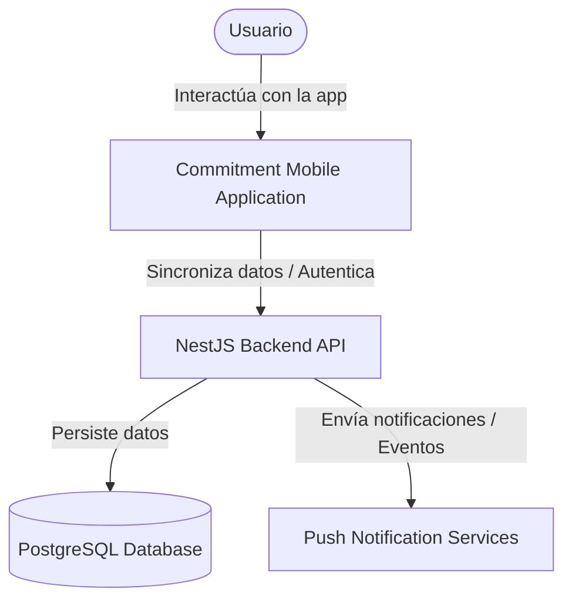
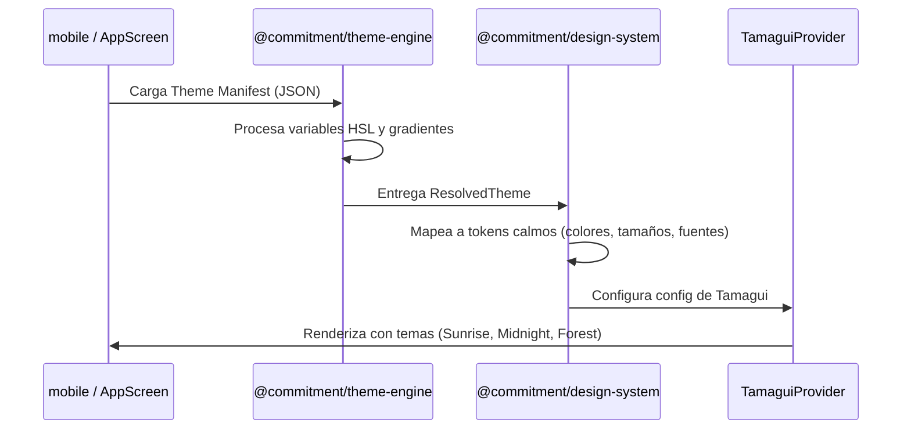
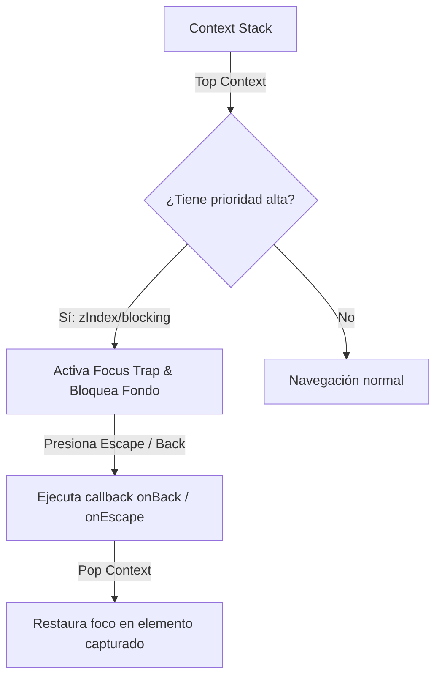
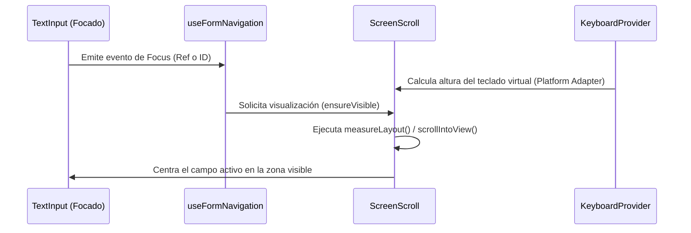

# Architecture Overview (Commitment v2)

Este documento detalla la arquitectura global del sistema, los diagramas C4 (Contexto y Contenedores), los flujos de interacción clave y las directrices de diseño calmo.

---

## 1. C4 Context Diagram

El diagrama de contexto ilustra cómo interactúan los usuarios con la plataforma **Commitment v2** y sus límites externos de sistema:



---

## 2. C4 Container Diagram

Este diagrama detalla los contenedores internos que componen la aplicación móvil y el servidor backend:

```mermaid
graph TB
    subgraph apps/mobile (React Native + Expo)
        Features[Business Features]
        DS[@commitment/design-system]
        ThemeEngine[@commitment/theme-engine]
        Localization[@commitment/localization]
        PlatformSDK[@commitment/platform]
        SQLite[(SQLite Local Db)]

        Features -->|Renderiza UI| DS
        Features -->|Consulta Datos| SQLite
        DS -->|Inyecta adapters| PlatformSDK
        DS -->|Valores de tema| ThemeEngine
        DS -->|Traducciones y fechas| Localization
    end

    subgraph apps/backend (NestJS Server)
        APIControllers[REST/GraphQL Controllers]
        CQRSHandlers[CQRS Command/Query Handlers]
        DomainModels[Pure Domain Domain Models]
        DBRepository[Postgres Repositories]

        APIControllers --> CQRSHandlers
        CQRSHandlers --> DomainModels
        CQRSHandlers --> DBRepository
    end

    Features -->|HTTP / Sync| APIControllers
```

---

## 3. Flujo del Sistema de Temas (Theme Engine)

El motor de apariencia resuelve los estilos dinámicos de forma agnóstica a partir de un archivo manifest JSON:



---

## 4. Orquestación del Focus Manager

La pila de foco priorizada del `FocusManager` administra dinámicamente qué elementos de la UI interactúan con la entrada del teclado y del sistema físico:



### Tabla de Prioridades Lógicas por Defecto:

- `screen`: `0` (Nivel base de navegación)
- `roving`: `50` (Pestañas, sub-listas)
- `dialog`: `100` (Modales invasivos)
- `bottomSheet`: `200` (Desplegables)
- `popover`: `300` (Menús rápidos)
- `tooltip`: `400` (Ayudas flotantes)
- `coach`: `1000` (Overlays de AI Coach)

---

## 5. Input Management & Auto-Scroll

Para evitar que el teclado nativo oculte los campos activos en formularios complejos, el Design System utiliza un observador dinámico:



---

## 6. Aislamiento de Plataforma (Platform Services)

El monorepo encapsula todas las llamadas a APIs del sistema operativo (`react-native`, `expo-secure-store`, etc.) bajo adaptadores del SDK de plataforma. Ninguna Feature importa hardware directamente.

```text
[ Feature (Slice de Negocio) ]
             ↓
[ Design System (Primitivas UI) ]
             ↓
[ Platform SDK (PlatformProvider & Services) ]
             ↓
[ Native OS APIs (Haptics, Keyboards, etc.) ]
```

### Inyección de Dependencias

En el arranque (`apps/mobile/src/app/_layout.tsx`), instanciamos los adaptadores físicos y los pasamos al proveedor global:

```tsx
const platformServices: PlatformServices = {
  haptics: {
    trigger: (type) => NativeHaptics.trigger(type),
  },
  keyboard: createKeyboardPlatformAdapter(),
};

// ...
<PlatformProvider services={platformServices}>
  <App />
</PlatformProvider>;
```

---

## 7. Internacionalización & Localización

El SDK de localización (`@commitment/localization`) centraliza el motor de idiomas e impone directrices estrictas:

- **Formateo Temporal:** El formateo de fechas y horas se realiza a través de las utilidades expuestas por el SDK, apoyándose en la zona horaria del usuario.
- **Prohibición de `Intl`:** Se prohíbe el uso directo del constructor `Intl` de JavaScript en las vistas para garantizar uniformidad en toda la aplicación y compatibilidad en entornos antiguos de JS runtime.
