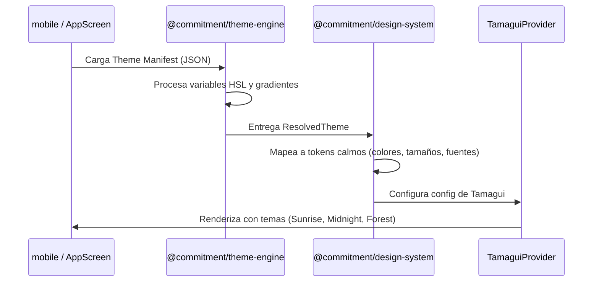
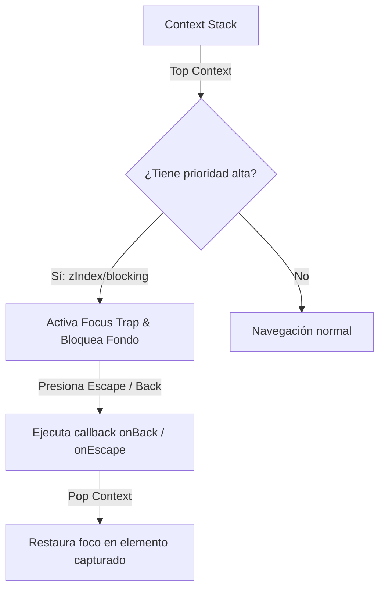
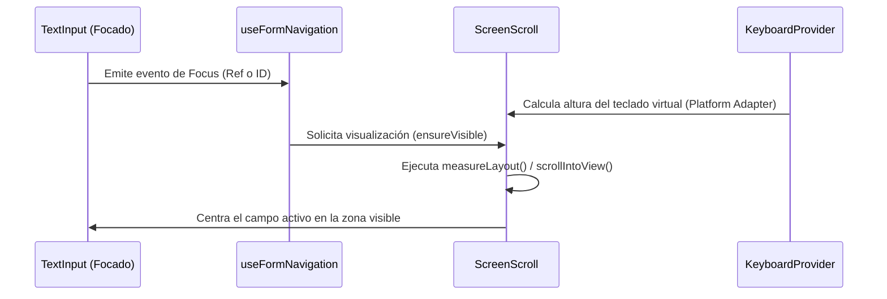

# Architecture Overview (Commitment v2)

Este documento detalla la arquitectura global del sistema, los diagramas C4 (Contexto y Contenedores), los flujos de interacción clave, las directrices de diseño calmo y las políticas operativas del monorepo.

---

## 1. C4 Context Diagram

El diagrama de contexto ilustra cómo interactúan los usuarios con la plataforma **Commitment v2** y sus límites externos de sistema:


---

## 2. C4 Container Diagram

Este diagrama detalla los contenedores internos que componen la aplicación móvil y el servidor backend:

```mermaid
graph TB
    subgraph apps/mobile (React Native + Expo)
        Features[Business Features]
        DS[@commitment/design-system]
        ThemeEngine[@commitment/theme-engine]
        Localization[@commitment/localization]
        PlatformSDK[@commitment/platform]
        SQLite[(SQLite Local Db)]

        Features -->|Renderiza UI| DS
        Features -->|Consulta Datos| SQLite
        DS -->|Inyecta adapters| PlatformSDK
        DS -->|Valores de tema| ThemeEngine
        DS -->|Traducciones y fechas| Localization
    end

    subgraph apps/backend (NestJS Server)
        APIControllers[REST/GraphQL Controllers]
        CQRSHandlers[CQRS Command/Query Handlers]
        DomainModels[Pure Domain Domain Models]
        DBRepository[Postgres Repositories]

        APIControllers --> CQRSHandlers
        CQRSHandlers --> DomainModels
        CQRSHandlers --> DBRepository
    end

    Features -->|HTTP / Sync| APIControllers
```

---

## 3. Key Decisions (Por Qué vs Cómo)

El diseño del monorepo está dictado por decisiones arquitectónicas intencionales orientadas al aislamiento de negocio y flexibilidad ante el cambio tecnológico:

| Decisión Clave                    | Motivo / Justificación                                                                                                                               | Estado    | Enlace                                                                          |
| :-------------------------------- | :--------------------------------------------------------------------------------------------------------------------------------------------------- | :-------- | :------------------------------------------------------------------------------ |
| **Domain sin React / Frameworks** | Evita la degradación del dominio. Las reglas de negocio permanecen portables, testeables unitariamente y reutilizables en backend y frontend.        | 🟢 Activo | [ADR-002](file:///Users/yereth/Desktop/Commitment-v2/docs/DECISIONS.md)         |
| **Theme Engine Agnóstico**        | Permite evaluar e interpretar temas ( Sunrise, Midnight, Forest) en Node.js, Web o Mobile sin dependencias visuales de React/Tamagui.                | 🟢 Activo | [ADR-014](file:///Users/yereth/Desktop/Commitment-v2/docs/DECISIONS.md)         |
| **Platform SDK Aislado**          | Desacopla por completo las APIs físicas (Haptics, Teclado, Almacenamiento Seguro) de los componentes de UI calmos.                                   | 🟢 Activo | [ADR-011](file:///Users/yereth/Desktop/Commitment-v2/docs/DECISIONS.md)         |
| **Localization SDK Único**        | Protege la internacionalización unificando la traducción y el parseo temporal en un único módulo para evitar fragmentación o dependencias de `Intl`. | 🟢 Activo | [ADR-013](file:///Users/yereth/Desktop/Commitment-v2/docs/DECISIONS.md)         |
| **Widget Registry Desacoplado**   | Fomenta la extensibilidad del Dashboard móvil. Los widgets se registran independientemente sin acoplar la pantalla principal.                        | 🟢 Activo | [Widget Registry](file:///Users/yereth/Desktop/Commitment-v2/docs/DECISIONS.md) |
| **Focus Stack con Prioridad**     | Resuelve el comportamiento e interacción accesible (Teclas Escape, Back y Tab-trapping) a través de un stack dinámico y priorizado.                  | 🟢 Activo | [Focus System](file:///Users/yereth/Desktop/Commitment-v2/docs/DECISIONS.md)    |

---

## 4. Request Flow (Flujo de Datos)

### Flujo de Lecturas (Query / Visualización de Datos)

Las lecturas fluyen de forma unidireccional y asíncrona mediante caches locales en UI:

```text
User / UI View
   │  (Renderizado de Componentes)
   ▼
Feature Slice (mobile)
   │  (Consume Hook de Presentación)
   ▼
React Query / Zustand
   │  (Valida caché local en SQLite / Memoria)
   ▼
Repository Adapter (Platform)
   │  (Envía petición HTTP)
   ▼
Backend Server (NestJS)
   │  (Resuelve mediante Read Model optimizado)
   ▼
Domain Read Model (DB PostgreSQL)
```

### Flujo de Escrituras (Comandos / Modificaciones del Compromiso)

Las mutaciones operan bajo principios de Event Sourcing y consistencia eventual:

```text
Usuario (Ejecuta Acción)
   │
   ▼
Command Dispatcher (mobile / backend)
   │  (Valida datos mediante Zod Contract)
   ▼
Aggregate Root (Domain)
   │  (Valida invariantes de regla de negocio)
   ▼
Domain Event (Generación de Evento inmutable)
   │
   ├─► Event Store (Postgres / SQLite local)
   │
   ├─► Activity Logger / Proyecciones (Procesa métricas)
   │
   └─► Timeline Projection (Actualiza Read Model visible)
```

---

## 5. Estrategia de Testing

Para garantizar la estabilidad ante actualizaciones (como la migración a RNTL v14 y React 19), se define la siguiente matriz de pruebas:

- **packages/domain:** Cobertura estricta del 100% de la lógica de agregados, invariantes y flujos de comandos utilizando pruebas unitarias puras en Jest (sin mocks externos).
- **packages/design-system:** Pruebas de integración asíncronas (`renderWithTheme` y `rerender` asíncronos en RNTL v14) para validar:
  - Comportamiento de los componentes calmos.
  - Accesibilidad semántica mediante roles (`getByRole` con `accessible={true}`).
  - Apilamiento de foco en el `FocusManager`.
- **packages/theme-engine:** Pruebas unitarias sobre la interpretación y validación de manifests JSON.
- **apps/backend:** Pruebas de integración y contratos API usando Supertest y NestJS Test modules para validar endpoints y CQRS Handlers.
- **apps/mobile:** Pruebas de integración de pantallas y flujo de navegación usando RNTL, simulando adaptadores inyectados.

---

## 6. Política de Versionado

El monorepo utiliza versionado semántico administrado bajo las siguientes directrices:

- **APIs Públicas de Paquetes:** Cualquier cambio en la firma de interfaces públicas (`useKeyboard`, `useFormNavigation`, `FocusContextConfig`) incrementa la versión **Major** del paquete correspondiente.
- **Compatibilidad Cruzada:** El monorepo usa enlaces directos de espacio de trabajo (`workspace:*`). Todos los paquetes se compilan y construyen de forma coordinada a través de Turborepo para asegurar compatibilidad inmediata antes de cada versión.
- **Theme Engine Manifests:** Los esquemas JSON de los temas poseen un campo de versión (`schemaVersion`). Cambios en la especificación base del esquema requieren una versión Major del `theme-engine` y una política de migración en el parseador para mantener soporte hacia atrás de manifests antiguos.

---

## 7. Flujo del Sistema de Temas (Theme Engine)

El motor de apariencia resuelve los estilos dinámicos de forma agnóstica a partir de un archivo manifest JSON:



---

## 8. Orquestación del Focus Manager

La pila de foco priorizada del `FocusManager` administra dinámicamente qué elementos de la UI interactúan con la entrada del teclado y del sistema físico:



---

## 9. Input Management & Auto-Scroll

Para evitar que el teclado nativo oculte los campos activos en formularios complejos, el Design System utiliza un observador dinámico:



---

## 10. Aislamiento de Plataforma (Platform Services)

El monorepo encapsula todas las llamadas a APIs del sistema operativo (`react-native`, `expo-secure-store`, etc.) bajo adaptadores del SDK de plataforma. Ninguna Feature importa hardware directamente.

```text
[ Feature (Slice de Negocio) ]
             ↓
[ Design System (Primitivas UI) ]
             ↓
[ Platform SDK (PlatformProvider & Services) ]
             ↓
[ Native OS APIs (Haptics, Keyboards, etc.) ]
```

### Inyección de Dependencias

En el arranque (`apps/mobile/src/app/_layout.tsx`), instanciamos los adaptadores físicos y los pasamos al proveedor global:

```tsx
const platformServices: PlatformServices = {
  haptics: {
    trigger: (type) => NativeHaptics.trigger(type),
  },
  keyboard: createKeyboardPlatformAdapter(),
};

// ...
<PlatformProvider services={platformServices}>
  <App />
</PlatformProvider>;
```

---

## 11. Internacionalización & Localización

El SDK de localización (`@commitment/localization`) centraliza el motor de idiomas e impone directrices estrictas:

- **Formateo Temporal:** El formateo de fechas y horas se realiza a través de las utilidades expuestas por el SDK, apoyándose en la zona horaria del usuario.
- **Prohibición de `Intl`:** Se prohíbe el uso directo del constructor `Intl` de JavaScript en las vistas para garantizar uniformidad en toda la aplicación y compatibilidad en entornos antiguos de JS runtime.
