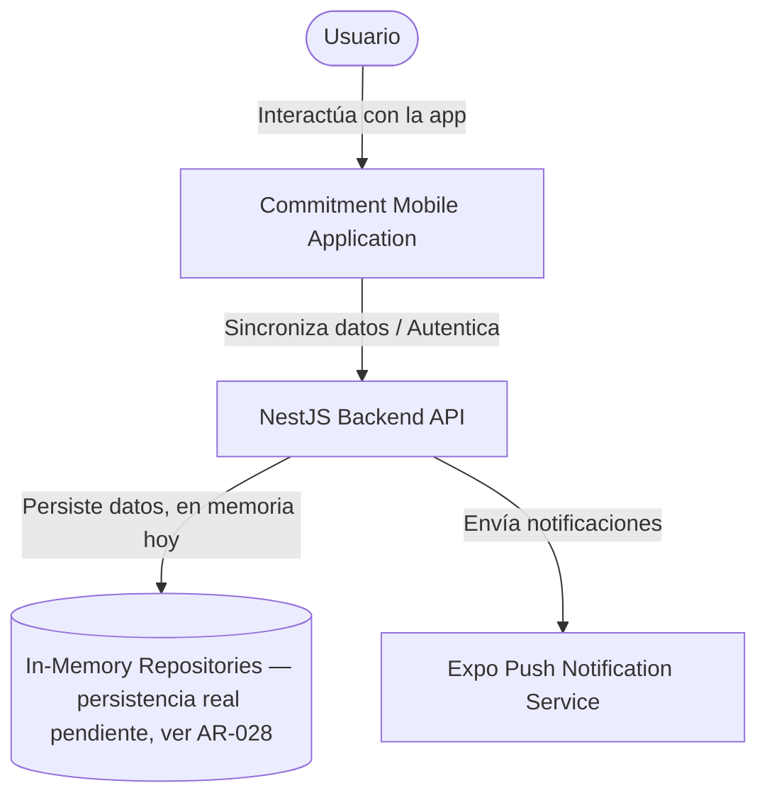
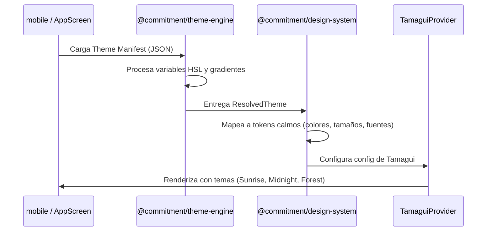
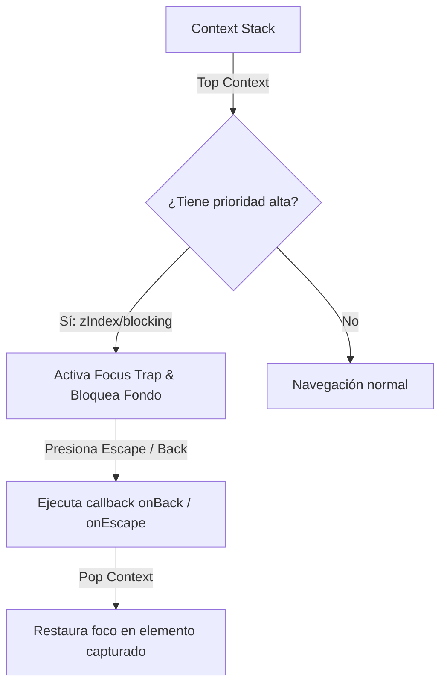
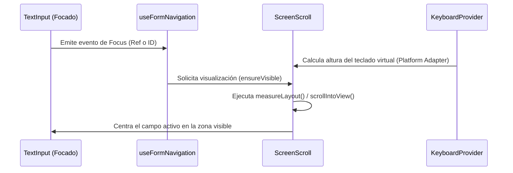

# Architecture Overview (Commitment v2)

Este documento detalla la arquitectura global del sistema, los diagramas C4 (Contexto y Contenedores), los flujos de interacción clave, las directrices de diseño calmo y las políticas operativas del monorepo.

**Corregido 2026-07-20 como parte de AR-001** (`docs/ARCHITECTURE_REMEDIATION/AR-001/ANALISIS.md`). La versión anterior de este documento describía PostgreSQL, SQLite local, Event Sourcing y Firebase Push — ninguno de los cuales existe en el código real — y enlazaba a rutas absolutas de otro repositorio (`file:///Users/yereth/Desktop/Commitment-v2/...`). La arquitectura de plataforma oficial y vigente está en **ADR-024** (`docs/03-architecture/adr_024_official_technology_platform.md`); la cronología de cómo este documento llegó a desactualizarse está en `docs/03-architecture/ARCHITECTURE_TRANSITION_2026.md`.

---

## 1. C4 Context Diagram

El diagrama de contexto ilustra cómo interactúan los usuarios con la plataforma **Commitment v2** y sus límites externos de sistema:



**Nota sobre autenticación:** el diagrama muestra "Autentica" como interacción conceptual — a la fecha, no existe ningún mecanismo real de autenticación/autorización en el backend (ver AR-043, `docs/ARCHITECTURE_REMEDIATION/REMEDIATION_ROADMAP_V1.md`). `identityId` se acepta sin verificación.

---

## 2. C4 Container Diagram

Este diagrama detalla los contenedores internos que componen la aplicación móvil y el servidor backend:

```mermaid
graph TB
    subgraph apps/mobile (React Native + Expo)
        Features[Business Features]
        DS[@commitment/design-system]
        ThemeEngine[@commitment/theme-engine]
        Localization[@commitment/localization]
        PlatformSDK[@commitment/platform]

        Features -->|Renderiza UI| DS
        Features -->|Server state| ReactQuery[React Query cache, en memoria]
        DS -->|Inyecta adapters| PlatformSDK
        DS -->|Valores de tema| ThemeEngine
        DS -->|Traducciones y fechas| Localization
    end

    subgraph apps/backend (NestJS Server)
        APIControllers[REST Controllers]
        CQRSHandlers[CQRS Command/Query Handlers vía @nestjs/cqrs]
        DomainModels[Domain Models — sin dependencias de framework]
        InMemoryRepos[In-Memory Repositories]

        APIControllers --> CQRSHandlers
        CQRSHandlers --> DomainModels
        CQRSHandlers --> InMemoryRepos
    end

    Features -->|HTTP| APIControllers
```

**No existe almacenamiento local persistente en mobile** (ni SQLite ni AsyncStorage ni MMKV) — confirmado por `docs/ARCHITECTURE_REVIEW/fase-3-escalabilidad/11-offline-first.md`. El caché de React Query no sobrevive el cierre de la app. Offline First está en ~10% de implementación real.

---

## 3. Key Decisions (Por Qué vs Cómo)

El diseño del monorepo está dictado por decisiones arquitectónicas intencionales orientadas al aislamiento de negocio y flexibilidad ante el cambio tecnológico:

| Decisión Clave                                       | Motivo / Justificación                                                                                                                               | Estado    | Enlace                                                                          |
| :--------------------------------------------------- | :--------------------------------------------------------------------------------------------------------------------------------------------------- | :-------- | :------------------------------------------------------------------------------ |
| **Plataforma oficial (frontend/backend/mensajería)** | Formaliza React Native+Expo, NestJS, y BullMQ+Redis como arquitectura vigente, tras resolver la divergencia con ADR-001–010.                         | 🟢 Activo | [ADR-024](adr_024_official_technology_platform.md)                              |
| **Domain sin React / Frameworks**                    | Evita la degradación del dominio. Las reglas de negocio permanecen portables, testeables unitariamente y reutilizables en backend y frontend.        | 🟢 Activo | Verificado en `docs/ARCHITECTURE_REVIEW/fase-1-nucleo/02-clean-architecture.md` |
| **Theme Engine Agnóstico**                           | Permite evaluar e interpretar temas ( Sunrise, Midnight, Forest) en Node.js, Web o Mobile sin dependencias visuales de React/Tamagui.                | 🟢 Activo | [ADR-014](03-architecture/adr_014_activity_history_recommendations.md)          |
| **Platform SDK Aislado**                             | Desacopla por completo las APIs físicas (Haptics, Teclado, Almacenamiento Seguro) de los componentes de UI calmos.                                   | 🟢 Activo | [ADR-011](03-architecture/adr_011_tech_stack_flexibility.md)                    |
| **Localization SDK Único**                           | Protege la internacionalización unificando la traducción y el parseo temporal en un único módulo para evitar fragmentación o dependencias de `Intl`. | 🟢 Activo | [ADR-013](03-architecture/adr_013_internationalization_first.md)                |
| **Widget Registry Desacoplado**                      | Fomenta la extensibilidad del Dashboard móvil. Los widgets se registran independientemente sin acoplar la pantalla principal.                        | 🟢 Activo | Sin ADR dedicada — ver `apps/mobile/src/features/dashboard/`                    |
| **Focus Stack con Prioridad**                        | Resuelve el comportamiento e interacción accesible (Teclas Escape, Back y Tab-trapping) a través de un stack dinámico y priorizado.                  | 🟢 Activo | Sin ADR dedicada — ver `packages/design-system/src/focus/`                      |

**Nota (2026-07-20):** las filas de esta tabla enlazaban previamente a `file:///Users/yereth/Desktop/Commitment-v2/docs/DECISIONS.md` — una ruta absoluta a un repositorio distinto de este (`iCloud/Desktop/Commitment-v2`). Corregido para enlazar dentro de este repo; donde no existe una ADR real correspondiente, se dice explícitamente en vez de inventar un enlace.

---

## 4. Request Flow (Flujo de Datos)

### Flujo de Lecturas (Query / Visualización de Datos)

Las lecturas fluyen de forma unidireccional y asíncrona mediante caches locales en UI:

```text
User / UI View
   │  (Renderizado de Componentes)
   ▼
Feature Slice (mobile)
   │  (Consume Hook de Presentación)
   ▼
React Query / Zustand
   │  (Valida caché local en SQLite / Memoria)
   ▼
Repository Adapter (Platform)
   │  (Envía petición HTTP)
   ▼
Backend Server (NestJS)
   │  (Resuelve mediante Read Model optimizado)
   ▼
Domain Read Model (DB PostgreSQL)
```

### Flujo de Escrituras (Comandos / Modificaciones del Compromiso)

**Corregido 2026-07-20:** las mutaciones operan bajo **CQRS de estado versionado** (ADR-021), no Event Sourcing — el estado del agregado nunca se reconstruye reproduciendo eventos; los repositorios in-memory guardan el estado ya resuelto como fuente de verdad. Los eventos de dominio sí se emiten (vía `@nestjs/cqrs`'s EventBus) para disparar Sagas y proyecciones de lectura, pero no son el mecanismo de persistencia:

```text
Usuario (Ejecuta Acción)
   │
   ▼
Command Dispatcher (mobile / backend)
   │  (Valida datos mediante Zod Schema en el controller)
   ▼
Aggregate Root (Domain)
   │  (Valida invariantes de regla de negocio)
   ▼
Domain Event (emitido vía EventBus)
   │
   ├─► In-Memory Repository (guarda el estado ya resuelto — persistencia real pendiente, ver AR-028)
   │
   ├─► Sagas (p. ej. RecurringCommitmentSaga) — coreografía, no todos los agregados la usan
   │
   └─► Query Services / Read Model (actualiza la proyección visible)
```

Excepción: `Goal` mantiene además un log de eventos aditivo real (`saveEvents`, con optimistic concurrency propio) como historial de auditoría no-autoritativo — ver `docs/ARCHITECTURE_REVIEW/fase-1-nucleo/05-event-store.md`. `Task` tiene el mismo mecanismo registrado pero nunca invocado (código muerto). `Commitment`/`Habit` no tienen esta feature.

---

## 5. Estrategia de Testing

Para garantizar la estabilidad ante actualizaciones (como la migración a RNTL v14 y React 19), se define la siguiente matriz de pruebas:

- **packages/domain:** Suite real, guiada por invariantes e idempotencia, considerada la mejor testeada del monorepo (`docs/ARCHITECTURE_REVIEW/fase-2-plataforma/10-testing.md`). **Corrección 2026-07-20:** esta suite y la e2e de backend existen y pasan, pero **CI no las ejecuta** (`.github/workflows/ci.yml` solo corre tests unitarios de backend y typecheck de mobile) — un badge verde de CI hoy implica más cobertura de la que realmente se valida. Ver AR-008.
- **packages/design-system:** Pruebas de integración asíncronas (`renderWithTheme` y `rerender` asíncronos en RNTL v14) para validar:
  - Comportamiento de los componentes calmos.
  - Accesibilidad semántica mediante roles (`getByRole` con `accessible={true}`).
  - Apilamiento de foco en el `FocusManager`.
- **packages/theme-engine:** Pruebas unitarias sobre la interpretación y validación de manifests JSON.
- **apps/backend:** Pruebas de integración y contratos API usando Supertest y NestJS Test modules para validar endpoints y CQRS Handlers.
- **apps/mobile:** Pruebas de integración de pantallas y flujo de navegación usando RNTL, simulando adaptadores inyectados.

---

## 6. Política de Versionado

El monorepo utiliza versionado semántico administrado bajo las siguientes directrices:

- **APIs Públicas de Paquetes:** Cualquier cambio en la firma de interfaces públicas (`useKeyboard`, `useFormNavigation`, `FocusContextConfig`) incrementa la versión **Major** del paquete correspondiente.
- **Compatibilidad Cruzada:** El monorepo usa enlaces directos de espacio de trabajo (`workspace:*`). Todos los paquetes se compilan y construyen de forma coordinada a través de Turborepo para asegurar compatibilidad inmediata antes de cada versión.
- **Theme Engine Manifests:** Los esquemas JSON de los temas poseen un campo de versión (`schemaVersion`). Cambios en la especificación base del esquema requieren una versión Major del `theme-engine` y una política de migración en el parseador para mantener soporte hacia atrás de manifests antiguos.

---

## 7. Flujo del Sistema de Temas (Theme Engine)

El motor de apariencia resuelve los estilos dinámicos de forma agnóstica a partir de un archivo manifest JSON:



---

## 8. Orquestación del Focus Manager

La pila de foco priorizada del `FocusManager` administra dinámicamente qué elementos de la UI interactúan con la entrada del teclado y del sistema físico:



---

## 9. Input Management & Auto-Scroll

Para evitar que el teclado nativo oculte los campos activos en formularios complejos, el Design System utiliza un observador dinámico:



---

## 10. Aislamiento de Plataforma (Platform Services)

El monorepo encapsula todas las llamadas a APIs del sistema operativo (`react-native`, `expo-secure-store`, etc.) bajo adaptadores del SDK de plataforma. Ninguna Feature importa hardware directamente.

```text
[ Feature (Slice de Negocio) ]
             ↓
[ Design System (Primitivas UI) ]
             ↓
[ Platform SDK (PlatformProvider & Services) ]
             ↓
[ Native OS APIs (Haptics, Keyboards, etc.) ]
```

### Inyección de Dependencias

En el arranque (`apps/mobile/src/app/_layout.tsx`), instanciamos los adaptadores físicos y los pasamos al proveedor global:

```tsx
const platformServices: PlatformServices = {
  haptics: {
    trigger: (type) => NativeHaptics.trigger(type),
  },
  keyboard: createKeyboardPlatformAdapter(),
};

// ...
<PlatformProvider services={platformServices}>
  <App />
</PlatformProvider>;
```

---

## 11. Internacionalización & Localización

El SDK de localización (`@commitment/localization`) centraliza el motor de idiomas e impone la arquitectura declarativa de traducción detallada en [ADR-013](file:///Users/yereth/Desktop/Commitment-v2/docs/03-architecture/adr_013_internationalization_first.md):

- **Regla 1 — Internacionalización Obligatoria (Zero Hardcoded Text):** Ningún texto visible al usuario puede agregarse directamente en una Feature. Esto incluye títulos, subtítulos, botones, placeholders, mensajes de error, snacks, diálogos, widgets, etc. Todo debe venir desde traducción.
- **Regla 2 — UI Declarativa (Ninguna Feature usa `t()`):** Las Features no llaman a `t()` directamente. Se provee la clave `i18nKey` a los componentes de tipografía y botones del Design System.
- **Regla 3 — Actualización Simultánea de Idiomas:** Cada cambio de locales requiere actualizar a la par inglés (`en/`) y español (`es/`).
- **Regla 4 — Rechazo de Strings Hardcodeados:** Todo componente que acepte hijos como texto plano literal será rechazado en el control de calidad.
- **Regla 5 — Accesibilidad Localizada:** Todos los anuncios de pantalla, descriptors y etiquetas de VoiceOver/TalkBack deben ir traducidos.
- **Regla 6 — Widgets Declarativos:** Widget Registry y Hero Cards se definen utilizando propiedades `i18nKey`, nunca textos planos.
- **Regla 7 — Definition of Done:** Ninguna feature se considera terminada hasta completar la internacionalización al 100% de los idiomas soportados.
- **Formateo Temporal:** El formateo de fechas y horas se realiza a través de las utilidades expuestas por el SDK, apoyándose en la zona horaria del usuario.
- **Prohibición de `Intl`:** Se prohíbe el uso directo del constructor `Intl` de JavaScript en las vistas para garantizar uniformidad en toda la aplicación y compatibilidad en entornos antiguos de JS runtime.
