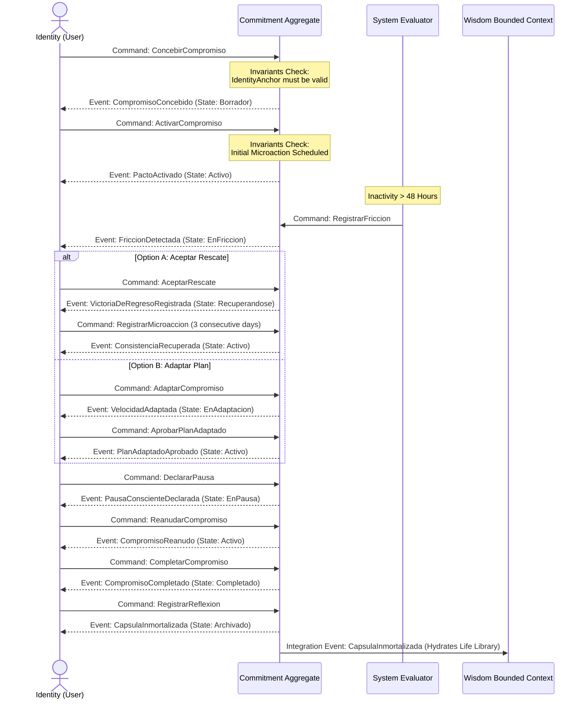

# Commitment Event Storming Specification

Version: 1.0.0
Status: Active
Owner: Architecture Review Board
Last Updated: 2026-07-04

---

This document represents the Domain Event Storming model for the **Commitment Bounded Context** timeline using Mermaid diagrams and workflow sequences.

---

## 🗺️ 1. Timeline & Aggregate Lifecycle Workflow

The sequence below tracks the lifecycle events, system evaluations, and user interactions from conception to archival.

---

## 🗃️ 2. Read Models & Analytics Projections

Event streams project changes to the following UI read models:

1. **`TableroCompromisosView` (Dashboard Projections):**
   - _Feeds on:_ `CompromisoConcebido`, `PactoActivado`, `CompromisoCompletado`, `CompromisoCanceladoConsciente`.
   - _Presents:_ List of active, draft, and completed commitments for the home page dashboard.
2. **`PresenteView` (Today's Microactions List):**
   - _Feeds on:_ `PactoActivado`, `ConsistenciaRecuperada`, `PausaConscienteDeclarada`.
   - _Presents:_ Atomic micro-actions (duration <30 mins) requiring immediate execution.
3. **`BibliotecaDeVidaView` (Wisdom Learning Repository):**
   - _Feeds on:_ `CapsulaInmortalizada`.
   - _Presents:_ Permanent archive of user reflections, learnings, and personal values.

---

## 🛡️ 3. Policies & Automated Rules

- **Inactivity Policy:**
  - _Trigger:_ Inactivity timer detects that 48 hours have elapsed without any registered micro-action executions.
  - _Effect:_ Emits a system command `RegistrarFriccion` to transition state to `EnFriccion`.
- **Rescued Consistency Policy:**
  - _Trigger:_ Three consecutive days of successful micro-actions are recorded on a recovering aggregate.
  - _Effect:_ Emits `ConsistenciaRecuperada` to return state from `Recuperandose` to `Activo`.

---

## 📜 Change History

- **v1.0.0 (2026-07-04):** Initial Event Storming model specification.
