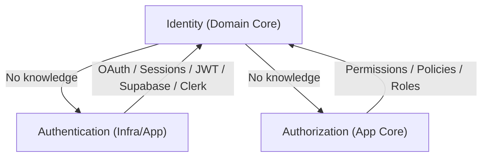

# Identity Bounded Context Specification

Version: 1.0.0
Status: Active
Owner: Architecture Review Board
Last Updated: 2026-07-04

---

This document outlines the design and boundary specifications of the **Identity Bounded Context** in `@commitment/domain`.

---

## 📐 Architectural Boundary & Decoupling

We enforce a strict separation of concerns between Identity, Authentication, and Authorization.



### 1. Identity != Authentication

The **Identity** context owns only the core business representation of the user (who they are). It has **zero knowledge** of:

- JWTs, OAuth, OIDC, passwords, or access tokens.
- Authentication providers (Clerk, Supabase Auth, Firebase, Auth0, Cognito, etc.).
- Cookies or active sessions.

_Why this separation exists:_
Authentication technologies change frequently and are highly dependent on external platforms. Decoupling them keeps the domain core completely portable, stable, and immune to shifts in infrastructure.

> [!NOTE]
> When authentication is introduced in future epics, a formal **Architecture Decision Record (ADR)** must be drafted to map how authentication credentials map to the `IdentityId` domain aggregate.

### 2. Identity != Authorization

The **Identity** context has no concept of roles, privileges, permissions, or security policies. Authorization logic belongs strictly inside the Application layer.

### 3. Identity != Profile

The `Identity` aggregate is **not** a general-purpose user profile. It contains only:

- `IdentityId` (Identifier)
- `Email` (Value Object)
- `DisplayName` (Value Object)
- `PreferredLanguage` (Value Object)
- `PreferredTimeZone` (Value Object)

It does **not** manage biography, avatar image URLs, streaks, streak history, notifications, or styling themes. Those properties belong to their respective Bounded Contexts.

---

## 🧱 DDD Specifications

### Aggregate Root: `Identity`

- **Identifier:** `IdentityId`
- **Creation Factory:** `Identity.register(...)`
- **Mutator Methods:** `Identity.update(...)`
- **Invariants protected:**
  - Standard format validation for emails.
  - Display name character limits.
  - Locale conformity (BCP-47 tags).
  - Valid timezone path formats.

---

## 📋 Public API Signatures

### Value Objects

- **`IdentityId`:** Wrapper for UUID v4/v7 strings.
- **`Email`:** Basic syntax validation `/^[^\s@]+@[^\s@]+\.[^\s@]+$/`.
- **`DisplayName`:** Trims input and enforces length `[1, 100]` characters.
- **`PreferredLanguage`:** BCP-47 locale tag validation (e.g. `en`, `es-CR`, `pt-BR`, `fr-CA`, `en-US`).
- **`PreferredTimeZone`:** Basic IANA path syntax validation (e.g., `America/New_York`, `UTC`).

### Domain Events (Rule #70 — Events Describe Facts)

Events carry only core domain attributes representing the fact. No redundant timestamps like `createdAt` or `updatedAt` exist in event payloads; occurrence timestamps are carried exclusively in the event envelope metadata.

- **`IdentityCreatedEvent`:** Emitted on registration. Payload: `identityId`, `email`, `displayName`, `preferredLanguage`, `preferredTimeZone`.
- **`IdentityUpdatedEvent`:** Emitted on profile updates. Payload: `identityId`, `displayName`, `preferredLanguage`, `preferredTimeZone`.

### Repository Contract

- **`IdentityRepository`:**
  ```typescript
  export interface IdentityRepository extends Repository<Identity> {
    save(identity: Identity): Promise<void>;
    findById(id: IdentityId): Promise<Identity | null>;
  }
  ```

---

## 📜 Change History

- **v1.0.0 (2026-07-04):** Initial specification for Identity Bounded Context.
